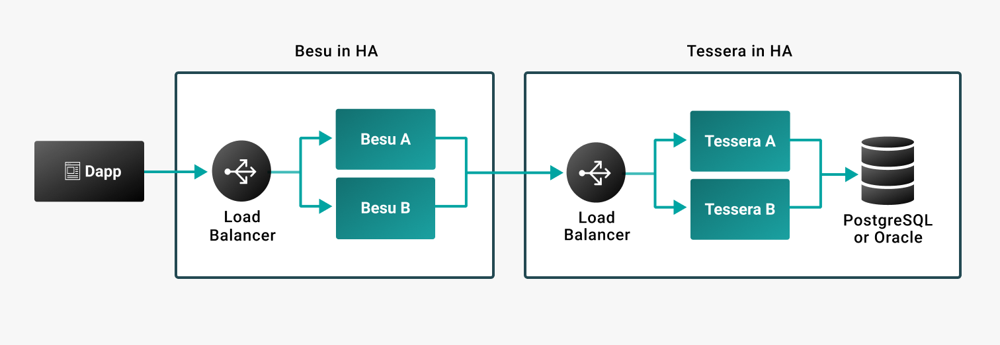

# Create a diagram

ConsenSys documentation sites contain diagrams created using [Figma](https://figma.com/).
You must have access to the ConsenSys **Quorum Diagrams** template files on Figma to create a diagram.
You can add a diagram to the documentation using the normal [contribution workflow](index.md#contribution-workflow) of
creating a pull request (PR).

Create diagrams to illustrate:

- Detailed or simplified product architecture.
- Technical processes and flows.
- Concept charts and tables.

The following video demonstrates creating a diagram for the GoQuorum documentation using Figma:

## Figma diagram guidelines

Use the following general guidelines when creating ConsenSys diagrams on Figma.
Refer to the [Figma help website](https://help.figma.com/hc/en-us) for more information on getting started with Figma,
Figma design elements, and more.

### Basics

- In the **Quorum Diagrams** file on Figma, each page contains diagrams for a different product.
- When creating a new diagram, create a new white frame in the product's page.
  Add frames within the white frame for each iteration of the diagram.
    - For each diagram, create a frame 756px wide using the **Global Background** color (#F6F6F6).
- You can resize a diagram's height, but keep the width at 756px.
  Anchor your elements to the frame using **Left** and **Top**
  [constraints](https://help.figma.com/hc/en-us/articles/360039957734-Apply-constraints-to-define-how-layers-resize).
- You can [group](https://help.figma.com/hc/en-us/articles/360039832054-Frames-and-Groups) and
  [rename and organize](https://help.figma.com/hc/en-us/articles/360038663994-Name-and-organize-components) elements.

!!! tip

    Hold down ++cmd++ on Mac or ++ctrl++ on Windows to
    [select](https://help.figma.com/hc/en-us/articles/360040449873-Select-layers-and-objects) elements excluding the
    frame.

### Style

- Use the premade diagram assets as starting points.
  By default, you can adjust the width of the premade labels, but the height is automatically sized to the number of
  lines of text.
  To free customize a component, right-click on it and **detach instance** and **remove auto layout**.
- Use font **Roboto** for all text.
  In general, use font sizes between 10-18.
- In general, use the pre-defined color styles.
- Use rounded corners of radius 2 for rectangular labels and containers.
- Evenly [align](https://help.figma.com/hc/en-us/articles/360039956914-Adjust-alignment-rotation-and-position) elements.
- Represent similar conceptual elements using similar styles.
  For example, represent two nodes using a dark gradient, and represent two external components using a light gradient.

!!! tip

    Hold down ++shift++ when drawing, resizing, and rotating to create perfect horizontal and vertical lines.

#### Arrows and lines

- Use a thickness of 2 for arrows, lines, borders, and other strokes.
- Use **Triangle** arrow heads.
- Use straight arrows and lines, with right-angle bends if needed.
  Don't use diagonal arrows and lines.
  If possible, don't overlap arrows and lines.
  To create additional bends in an arrow or line, **detach instance** (if applicable), double-click the arrow or line,
  and click and drag the anchor points.
- Leave about 3px of space between arrow heads and the elements they point to.
  Line ends without arrow heads should touch the connecting element.

!!! example

    

See the
[Figma documentation on the Arrow Tool](https://help.figma.com/hc/en-us/articles/360040450133-Using-Shape-Tools#h_677f8eba-73c4-4987-a64b-c0226aaec392)
for more information.

### Export

To export your diagram:

1. Select the frame of your diagram.
    Make sure all elements of your diagram are contained in the frame.
    The name of this frame will be the name of the exported image.

1. Scroll to the bottom of the right sidebar.
    In the **Export** section, choose **2x** scale (for retina screens) and **PNG** or **JPG** file format.

1. Export the diagram to the image folder of the documentation site (for example, `doc.goquorum/docs/images`).

See [Figma's guide to exports](https://help.figma.com/hc/en-us/articles/360040028114-Guide-to-exports-in-Figma) for more
information.

Embed the diagram into a documentation page using ``, then create your PR.
When your diagram is finalized and merged into the documentation, list the finalization date next to the diagram in Figma.
