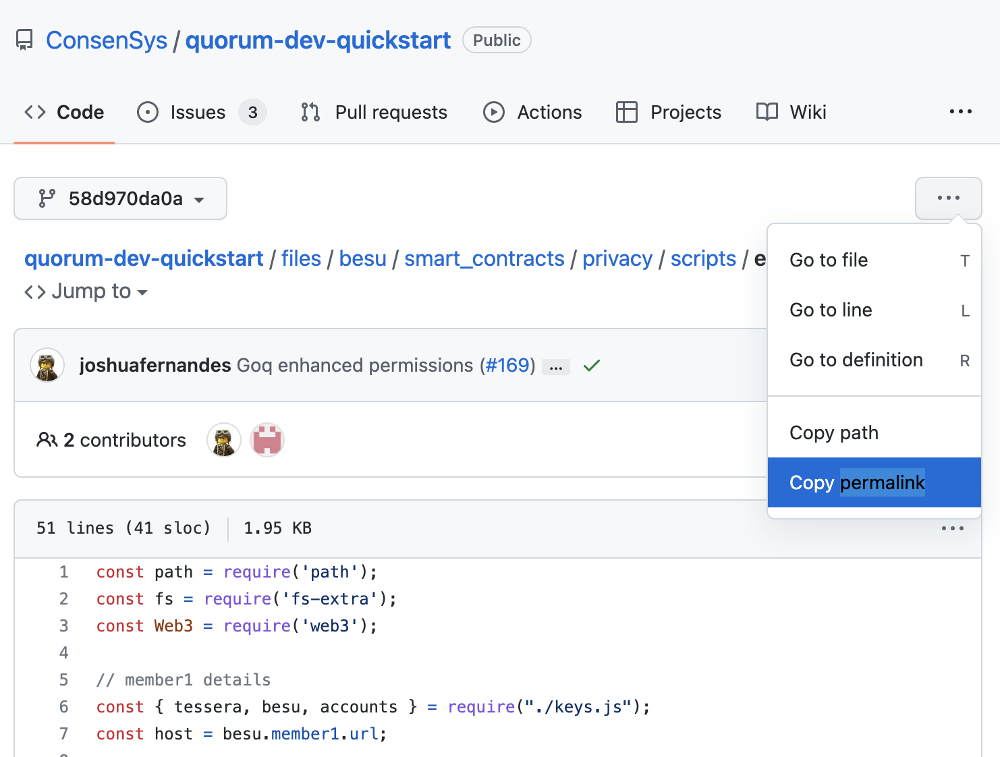

# Documentation style guide

The following are writing style guidelines for contributing to the ConsenSys documentation.
These guidelines aim to keep the documentation consistent, well-organized, and easy to understand.

## General guidelines

1. **Be consistent** - Consistency helps users follow and understand the documentation.
    By being consistent with your word choices, visual formatting, and style of communication, users know what to expect when they read the documentation.
    For example, use consistent sentence structures when [writing step-by-step instructions](https://docs.microsoft.com/en-us/style-guide/procedures-instructions/writing-step-by-step-instructions).

1. **Be simple but technically correct** - Avoid technical jargon and assume the user isn't an Ethereum expert.
    When an understanding of a complex Ethereum concept is required, you can refer users to external resources.
    For example, to explain how the EVM works, link to a resource such as the [Ethereum Wiki](https://eth.wiki/en/concepts/evm/ethereum-virtual-machine-(evm)-awesome-list).

1. **Be proactive and suggest good practices** - Anticipate users' needs and guide them through a process.
    This often takes the form of [notes or tips](markdown/extensions.md#call-outs) alongside the main explanation.
    Put yourself in the user's shoes and consider what questions you'd have when reading the documentation.

    Documenting good practices is also important.
    For example, instruct users to secure private keys and protect RPC endpoints in production environments.

1. **Be informative but concise** - Provide enough information to help users develop a mental model of how the software works without forcing them to read too much text or redundant detail.
    Cut down your text by [using simple words and concise sentences](https://docs.microsoft.com/en-us/style-guide/word-choice/use-simple-words-concise-sentences).

1. **Be inclusive** - ConsenSys documentation aims to be inclusive to all users.
    Refer to the [Google inclusive documentation guide](https://developers.google.com/style/inclusive-documentation) and the [Microsoft bias-free communication guide](https://docs.microsoft.com/en-us/style-guide/bias-free-communication) as starting points.

## Writing style guide

ConsenSys documentation follows the [Microsoft Writing Style Guide](https://docs.microsoft.com/en-us/style-guide/welcome/), which is a straightforward reference for natural and clear writing style.
The following are some important style recommendations:

- **Abbreviations** - Avoid [abbreviations and acronyms](https://docs.microsoft.com/en-us/style-guide/acronyms) unless they're well-known or often repeated in the documentation.
  Use "for example" instead of "e.g," and "that is" instead of "i.e."
- **Active voice** - Use [active voice](https://docs.microsoft.com/en-us/style-guide/grammar/verbs#active-and-passive-voice) where possible.
  Use "you" to create a personal tone.
- **Code samples** - Provide [code samples](markdown/extensions.md#code-samples) that can be copied and pasted in a console or editor with minimal editing, and work as expected.
    - When writing code samples in a programming language, refer to the programming language's style guide.
    - Always provide code samples as text in a code block; never use screenshots that would force the user to type it manually.
    - When breaking up lines in a command sample, add line breaks (`\`) to ensure it can work when pasted.
    - Don't include the console prompt (`>`,`$`,`#`,`%`, or the full `user@mycomputer Develop %`) or other characters that would prevent the command to run when pasted.
    - If values must be replaced in a sample, use placeholders such as `<your IP address>`.
- **Contractions** - Use common contractions, such as "it’s" and "you’re," to create a friendly, informal tone.
- **Sentence case for headings** - Use sentence case instead of title case for headings.
- **"We recommend"** - In general, don't use first person. However, use "we recommend" to introduce a product recommendation.
  Don't use "ConsenSys recommends" or "it is recommended."
- **GitHub permalinks** - When linking to a GitHub file, use the
  [permanent link (permalink)](https://ethereum.github.io/keymanager-APIs/) to the file.
  You can copy the permalink by selecting the three dots (`...`) in the upper right corner of the file page, and
  selecting **Copy permalink**.

    

Refer to the [Microsoft Guide](https://docs.microsoft.com/en-us/style-guide/welcome/) for any other questions on style.

## Documentation system guide

Refer to the [Divio documentation system guide](https://documentation.divio.com/) for how to structure, classify, and
arrange the different functional elements of documentation (for example, tutorials, how-to guides, and references).
