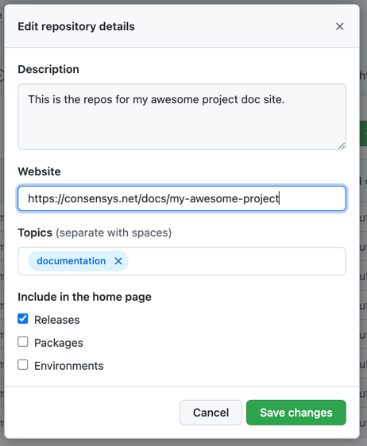

# Create a new documentation site

The following guidelines explain how to create a new ConsenSys documentation site from the existing template.
New documentation sites use the [new documentation system](../overview/index.md#documentation-sites-that-use-the-new-system).

To create a new site, you must have permission to create a new repository in the
[ConsenSys GitHub organization](https://github.com/ConsenSys).

You can also [create a new site template](create-site-template.md).

## Steps

1. Go to the [template repository](https://github.com/ConsenSys/doctools.template-site) (this Doctool site's repository).

1. Select the green **Use this template** button.

1. Create the new documentation repository.
    For consistency across documentation sites, name the repository in the format `doc.<project-name>`, with
    `<project-name>` lowercase.
    You can make this repository private or public depending on the project's needs.

    {: style='border:solid 1px'}

    The new repository is created.

    {: style='border:solid 1px'}

1. Update the **About** information.

    

1. In your repository's **Settings**, update the configuration as follows:
    * :material-checkbox-blank-outline: Template repository
    * :material-checkbox-blank-outline: Wikis
    * :material-checkbox-outline: Restrict editing to users in teams with push access only
    * :material-checkbox-outline: Issues
    * :material-checkbox-outline: Allow forking
    * :material-checkbox-blank-outline: Sponsorships
    * :material-checkbox-blank-outline: or :material-checkbox-outline: Projects (depends on your needs)
    * :material-checkbox-blank-outline: or :material-checkbox-outline: Discussions (depends on your needs)
    * :material-checkbox-blank-outline: Allow merge commits
    * :material-checkbox-outline: Allow squash merging
    * :material-checkbox-blank-outline: Allow rebase merging
    * :material-checkbox-outline: Allow auto-merge
    * :material-checkbox-blank-outline: Automatically delete head branches
    * :material-checkbox-blank-outline: Include Git LFS objects in archives

1. In the **Access** settings:
    * You should already be an admin on this repository.
      Add the documentation team **ConsenSys/protocol-pliny** as an admin too.
    * Add your team as maintainers (add the GitHub team instead of individual users).

1. In the **Branches** settings:
    * Add a new branch protection rule for the `main` branch with the following configuration:
        * **Branch name pattern** is `main`
        * :material-checkbox-outline: Require a pull request before merging
        * :material-checkbox-outline: Require status checks to pass before merging
        * :material-checkbox-outline: Require branches to be up to date before merging
        * :material-checkbox-outline: Require conversation resolution before merging
        * :material-checkbox-outline: Include administrators
        * The rest are unchecked

1. In the **Webhooks** settings:
    * TODO (notifications)

1. In the **Actions** settings:
    * If the repository is private, select **Allow all actions**.
    * If the repository is public, select **Allow select actions** and add the following configuration:
        * :material-checkbox-outline: Allow actions created by GitHub

        ```text title="Allow specified actions"
        FranzDiebold/github-env-vars-action@*,
        JamesIves/github-pages-deploy-action@*,
        actions/checkout@v2,
        c-py/action-dotenv-to-setenv@*,
        gaurav-nelson/github-action-markdown-link-check@*,
        github/super-linter/slim@*,
        jakejarvis/s3-sync-action@*,
        marocchino/sticky-pull-request-comment@*,
        ```

1. In the **Secrets** settings, ask the ConsenSys docOps team to set up the following secrets:
    * `AWS_ACCESS_KEY_ID` from `docops_doctool_doc_site_deployer` IAM user
    * `AWS_SECRET_ACCESS_KEY` from `docops_doctool_doc_site_deployer` IAM user
    * `AWS_S3_BUCKET`, the S3 bucket to which to publish the documentation site
    * `AWS_REGION`, the region where your S3 bucket is located (for example, `us-east-2`)
    * `PROJECT`, the project name to be used as folder name and key
    * `SITE_ROOT`, the documentation site root path including the project name and a leading `/` (for example,
      `https://consensys.net/docs/doctools/`)

1. If your repository is public, set up a Contributor License Agreement with [cla-assistant](https://cla-assistant.io/).
