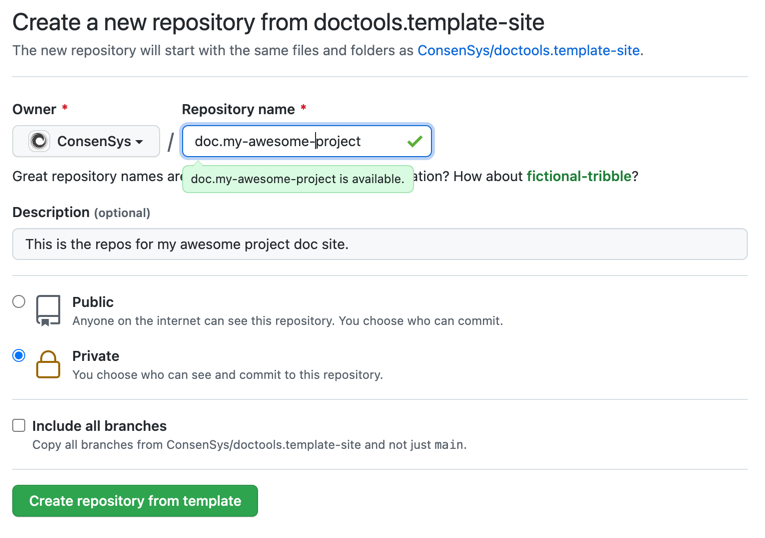
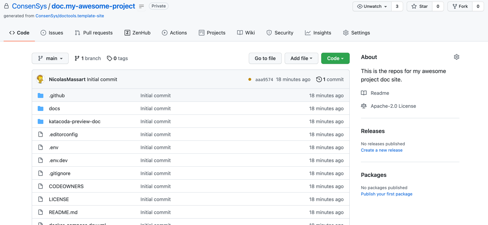

# How to create a new doc site

!!! info "Requirements"
    Creating a new doc site from the template requires to:

    * have access to [Github](https://github.com/).
    * have [the tools to handle Git repositories](https://git-scm.com/downloads/guis).
    * have the right to create a new repository in the [ConsenSys Github organisation](https://github.com/ConsenSys).
    * have a modern text editor[^1], preferably with MarkDown[^3] and YAML[^4] support.

[^1]:
    UFT-8 and linux end-of-lines capable.
    We use intelliJ, Atom, Sublime but feel free to use your favourite one.
    It has to be raw text capable, no Word or Google Docs

[^2]:
    Ask on ConsenSys Slack #documentation channel.

[^3]:
    [https://daringfireball.net/projects/markdown/](https://daringfireball.net/projects/markdown/)

[^4]:
    [https://yaml.org/](https://yaml.org/)

## Create a new repos from the template

Creating a new documentation site starts by using the template site.

!!! important
    For the doc sites to be easy to spot, we prefer that you name the new repos using the pattern `doc.[projet_name]`
    where `[project_name]` is your project name, lower-cased.

1. Navigate to the template repos: https://github.com/ConsenSys/doctools.template-site

1. Click the green "Use this template" button
1. you can make this repository private or public depending on your needs. Discuss this with the documentation team[^2]!

    {: style='border:solid 1px'}

1. The new repository is created! Congrats!

    {: style='border:solid 1px'}

1. Update the "About" infos.

    

1. In your repository global settings (`https://github.com/ConsenSys/doc.my-awesome-project/settings`), update configuration:
    * :material-checkbox-blank-outline: for `Template repository `
    * :material-checkbox-blank-outline: for `Wiki`
    * :material-checkbox-outline: for `Restrict editing to users in teams with push access only`
    * :material-checkbox-outline: for `Issues`
    * :material-checkbox-outline: for `Allow forking`
    * :material-checkbox-blank-outline: for `Sponsorships`
    * :material-checkbox-blank-outline: or :material-checkbox-outline: for `Projects` (depends on your needs)
    * :material-checkbox-blank-outline: or :material-checkbox-outline: `Discussions` (depends on your needs)
    * :material-checkbox-blank-outline: for `Allow merge commits`
    * :material-checkbox-outline: for `Allow squash merging`
    * :material-checkbox-blank-outline: for `Allow rebase merging`
    * :material-checkbox-outline: for `Allow auto-merge`
    * :material-checkbox-blank-outline: for `Automatically delete head branches`
    * :material-checkbox-blank-outline: for `Include Git LFS objects in archives`
1. In your repository **access** settings (`https://github.com/ConsenSys/doc.my-awesome-project/settings/access`):
    * You should already be `admin` on this repository, but to make sure the doc team can help you, add `@ConsenSys/protocol-pliny` as admin too.
    * Add your team as `maintainers` (use team instead of adding individuals)
1. In your repository **branches** settings (`https://github.com/ConsenSys/doc.my-awesome-project/settings/branches`):
    * Add a new branch protection rule for the `main` branch (Github now creates repos with `main` as default branch name)
        * set `Branch name pattern` to `main`
        * :material-checkbox-outline: for `Require a pull request before merging`
        * :material-checkbox-outline: for `Require status checks to pass before merging`
        * :material-checkbox-outline: for `Require branches to be up to date before merging`
        * :material-checkbox-outline: for `Require conversation resolution before merging`
        * :material-checkbox-outline: for `Include administrators`
        * keep the remaining unchecked and click `Create`.
1. In your project **webhooks** settings (`https://github.com/ConsenSys/doc.my-awesome-project/settings/hooks`):
    * TODO (notifications)
1. In your repository **actions** settings (`https://github.com/ConsenSys/doc.my-awesome-project/settings/actions`):
    * if your repository is private, check `Allow all actions`.
    * if your repository is public, select `Allow select actions`:
        * :material-checkbox-outline: for `Allow actions created by GitHub`
        * Add the following to the `Allow specified actions` field:

          ```text
          FranzDiebold/github-env-vars-action@*,
          JamesIves/github-pages-deploy-action@*,
          actions/checkout@v2,
          c-py/action-dotenv-to-setenv@*,
          gaurav-nelson/github-action-markdown-link-check@*,
          github/super-linter/slim@*,
          jakejarvis/s3-sync-action@*,
          marocchino/sticky-pull-request-comment@*,
          ```

1. In your repository **secrets** settings (`https://github.com/ConsenSys/doc.my-awesome-project/settings/secrets/actions`):

    Ask the docOps team[^2] to setup the following secrets:

    * `AWS_ACCESS_KEY_ID` from `docops_doctool_doc_site_deployer` user
    * `AWS_SECRET_ACCESS_KEY` from `docops_doctool_doc_site_deployer` user
    * `SITE_URL_BASE`

1. If your repository is public, setup a CLA with [cla-assistant](https://cla-assistant.io/)

*[CLA]: Contributor License Agreement
